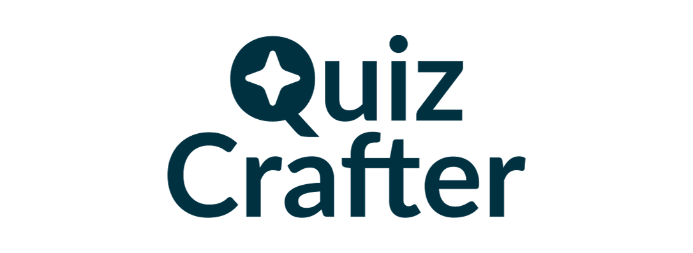
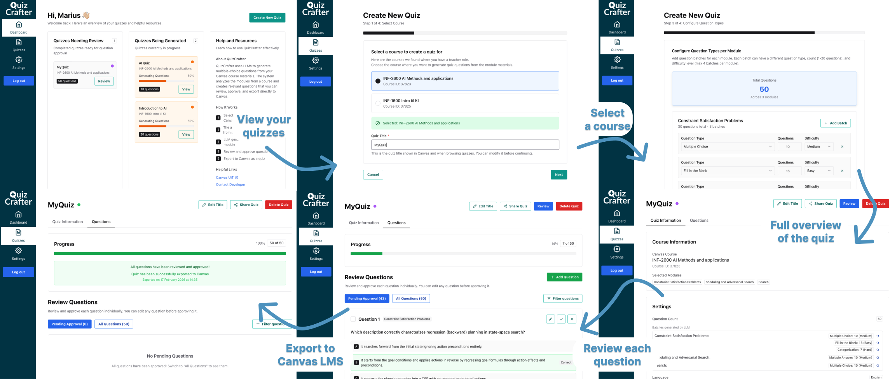

# QuizCrafter - AI-Powered Quiz Generator for Canvas

QuizCrafter is a web application designed to help instructors and course coordinators streamline the creation of high-quality quizzes for their courses in the Canvas LMS. By leveraging the power of Large Language Models (LLMs), QuizCrafter analyzes your course materials and automatically generates relevant questions, significantly reducing the time and effort required to create a robust question bank.



## Key Features

- **Seamless Canvas Integration**:
  - Securely log in using your existing Canvas credentials via OAuth2.
  - Browse your Canvas courses and select content (modules, pages, files) to be used for question generation.
- **AI-Powered Question Generation**:
  - Utilizes LLMs to analyze course materials, including text and PDF files.
  - Generates 6 question types: Multiple Choice, Multiple Answer, True/False, Fill in the Blank, Matching, and Categorization.
  - Supports question generation in multiple languages (English and Norwegian).
  - Configurable tone of voice (academic, casual, encouraging, professional) and difficulty levels.
- **Comprehensive Review Workflow**:
  - Review, edit, approve, or reject generated questions to ensure quality and accuracy.
  - Bulk operations for efficient question management.
  - Rejection feedback for iterative improvement.
- **Direct-to-Canvas Export**:
  - Compile approved questions into a quiz.
  - Export the quiz directly back to your Canvas course with a single click.
- **Quiz Sharing & Collaboration**:
  - Share quizzes with colleagues via invite links.
  - Collaborative review with multiple users.
- **Manual Content Support**:
  - Upload custom content or enter text directly for question generation.
  - Not limited to Canvas modules — bring your own materials.
- **Internationalization**:
  - Full UI support for English and Norwegian.
  - Language preference saved per user.
- **Onboarding**:
  - Guided onboarding flow for new users with feature walkthrough and privacy policy acceptance.
- **Real-time Progress Tracking**:
  - A consolidated status system tracks the entire quiz creation lifecycle, from content extraction to final publication.
  - Visual indicators provide immediate feedback on the status of your quiz generation tasks.

## Architecture Overview

QuizCrafter is a full-stack web application built with a modern, containerized architecture.

- **Backend**: A modular API built with **FastAPI** (Python) using domain-driven design. Each feature (auth, canvas, quiz, question, content extraction) lives in its own package with models, routes, services, and schemas.
- **Frontend**: A responsive single-page application (SPA) built with **React** and **TypeScript**. It features 80+ components, 11 custom hooks, internationalization, and a smart polling system for real-time updates.
- **Database**: A **PostgreSQL** database stores all application data. **Alembic** is used for database migrations.
- **Infrastructure**: The entire application stack is containerized using **Docker** and managed with **Docker Compose**. This includes a **Traefik** reverse proxy and a **Grafana/Loki/Promtail** stack for monitoring and logging.

### Status System

A core feature of the application is its robust status system, which tracks a quiz through its entire lifecycle:

- **States**: `created` → `extracting_content` → `generating_questions` → `ready_for_review` / `ready_for_review_partial` → `exporting_to_canvas` → `published`
- **Failure Tracking**: A `failed` state, coupled with a specific reason, allows for easy debugging of issues in the generation process.

## Tech Stack

| Category             | Technology                                                                                                                                                                                                                                                     |
| -------------------- | -------------------------------------------------------------------------------------------------------------------------------------------------------------------------------------------------------------------------------------------------------------- |
| **Backend**          | [Python](https://www.python.org/), [FastAPI](https://fastapi.tiangolo.com/), [SQLModel](https://sqlmodel.tiangolo.com/), [SQLAlchemy](https://www.sqlalchemy.org/), [Alembic](https://alembic.sqlalchemy.org/), [LangChain](https://python.langchain.com/)     |
| **Frontend**         | [TypeScript](https://www.typescriptlang.org/), [React](https://reactjs.org/), [Vite](https://vitejs.dev/), [TanStack Router & Query](https://tanstack.com/), [Chakra UI](https://chakra-ui.com/), [i18next](https://www.i18next.com/), [Zod](https://zod.dev/) |
| **Database**         | [PostgreSQL](https://www.postgresql.org/)                                                                                                                                                                                                                      |
| **Infrastructure**   | [Docker](https://www.docker.com/), [Docker Compose](https://docs.docker.com/compose/), [Traefik](https://traefik.io/traefik/)                                                                                                                                  |
| **Testing**          | [Pytest](https://pytest.org/) (Backend), [Playwright](https://playwright.dev/) (Frontend E2E)                                                                                                                                                                  |
| **DevOps & Linting** | [GitHub Actions](https://github.com/features/actions), [uv](https://github.com/astral-sh/uv), [Ruff](https://beta.ruff.rs/), [MyPy](https://mypy-lang.org/), [Biome](https://biomejs.dev/), [pre-commit](https://pre-commit.com/)                              |
| **Monitoring**       | [Grafana](https://grafana.com/), [Loki](https://grafana.com/oss/loki/), [Promtail](https://grafana.com/docs/loki/latest/clients/promtail/), [Sentry](https://sentry.io/)                                                                                       |

## Project Structure

```text
/
├── backend/              # FastAPI backend application
│   ├── src/              # Application source code (modular packages)
│   │   ├── auth/         # Authentication & user management
│   │   ├── canvas/       # Canvas LMS API integration
│   │   ├── quiz/         # Quiz management & orchestration
│   │   ├── question/     # Question types, generation, providers
│   │   └── content_extraction/  # HTML/PDF content processing
│   ├── tests/            # Pytest test suite
│   ├── alembic/          # Database migrations
│   └── scripts/          # Build and deployment scripts
├── frontend/             # React frontend application
│   ├── src/
│   │   ├── components/   # 80+ React components by feature
│   │   ├── hooks/        # 11 custom React hooks
│   │   ├── i18n/         # Internationalization (en, no)
│   │   ├── routes/       # TanStack Router file-based routing
│   │   ├── client/       # Auto-generated API client
│   │   └── lib/          # Utilities, constants, validation
│   └── tests/            # Playwright E2E tests
├── docs/                 # In-depth project documentation
├── scripts/              # Project-level utility scripts
├── mocks/                # Canvas LMS mock server for local dev
├── grafana/              # Grafana dashboards and provisioning
├── promtail/             # Promtail log collection config
├── .github/              # GitHub Actions CI/CD workflows
├── docker-compose.yml    # Main Docker Compose configuration
└── README.md             # This file
```

## Getting Started (Local Development)

The fastest way to get the entire application stack running locally is with Docker.

**Prerequisites:**

- Git
- Docker & Docker Compose

**1. Clone the repository:**

```bash
git clone <repository-url>
cd <repository-name>
```

**2. Configure your environment:**

Create a `.env` file in the project root by copying the example.
A `.env.example` file is provided at the root of this project. Copy this file to `.env` and fill in the required values.

```bash
cp .env.example .env
```

You will need to fill in the following critical variables:

- `SECRET_KEY`: A strong, unique secret key. You can generate one with `openssl rand -hex 32`.
- `POSTGRES_USER`, `POSTGRES_PASSWORD`, `POSTGRES_DB`: Credentials for your local database.
- `CANVAS_CLIENT_ID`, `CANVAS_CLIENT_SECRET`: Your Canvas Developer Key credentials.
- `CANVAS_BASE_URL`: The base URL of your Canvas instance (e.g., `https://canvas.uit.no`).

For local development without a real Canvas instance, set `USE_CANVAS_MOCK=True` to use the built-in Canvas mock server.

**3. Start the application:**

```bash
docker compose watch
```

This command builds the Docker images and starts all services with hot-reloading enabled for the frontend and backend.

**4. Access the services:**

Once the stack is running, you can access the different parts of the application:

- **Frontend**: <http://localhost:5173>
- **Backend API Docs**: <http://localhost:8000/docs>
- **Traefik Dashboard**: <http://localhost:8090>
- **Grafana Dashboard**: <http://localhost:3000>
- **Database Admin**: <http://localhost:8081>

## Development Workflow

While the entire stack runs in Docker, development is typically focused on either the backend or the frontend. For detailed instructions on setting up a local development environment, running linters, and other service-specific tasks, please refer to the README files in their respective directories:

- **Backend Development**: [`backend/README.md`](backend/README.md)
- **Frontend Development**: [`frontend/README.md`](frontend/README.md)

### Generating the Frontend API Client

The frontend uses a generated TypeScript client to communicate with the backend API. After making changes to the backend API, you should regenerate this client by running the script from the project root:

```bash
./scripts/generate-client.sh
```

## Testing

The project includes a comprehensive test suite for both the backend and frontend.

- **Backend (Pytest)**:

  ```bash
  # Run tests against the running services
  docker compose exec backend bash scripts/tests-start.sh
  ```

- **Frontend (Playwright E2E)**:

  ```bash
  # Ensure the stack is running, then run from the frontend directory
  cd frontend
  npx playwright test
  ```

For more detailed testing instructions, see the service-specific READMEs.

## CI/CD

This project uses **GitHub Actions** for Continuous Integration and Continuous Deployment. Workflows are defined in the `.github/workflows` directory and include jobs for:

- Linting and formatting checks (backend and frontend)
- Running backend tests with coverage reporting
- Running frontend Playwright E2E tests with multi-shard parallelism
- Building and pushing Docker images

## Helpful Links

- [Canvas LMS Developer Documentation](https://developerdocs.instructure.com/services/canvas) - Official Canvas API docs for question types and API calls
- [Full Stack FastAPI Template](https://github.com/fastapi/full-stack-fastapi-template/tree/master) - The template this project was originally built from

## License

This project is licensed under the MIT License. See the [LICENSE](LICENSE) file for details.
